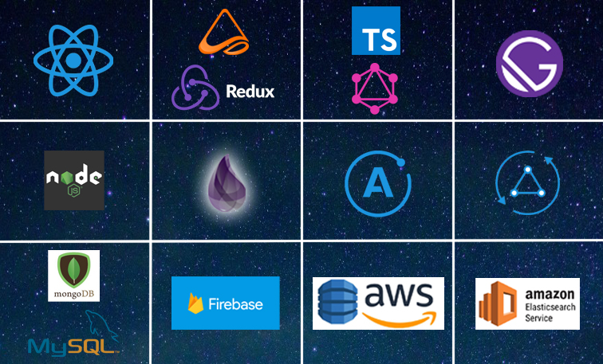

**WBookApp** is a HCMC distributed engineering consultancy and software development organization, specializing in React.js, React Native, GraphQL, Node.js, Elixir, AWS Mobile and the extended JavaScript ecosystem.

We are a team of developers with a can-do attitude. A distributed group of workmates with collaborative minds who can rely on each other. Our developers having various backgrounds, who share their passions and ideas with respect to diversity. We build mobile web application with React and cutting-edge technology.
