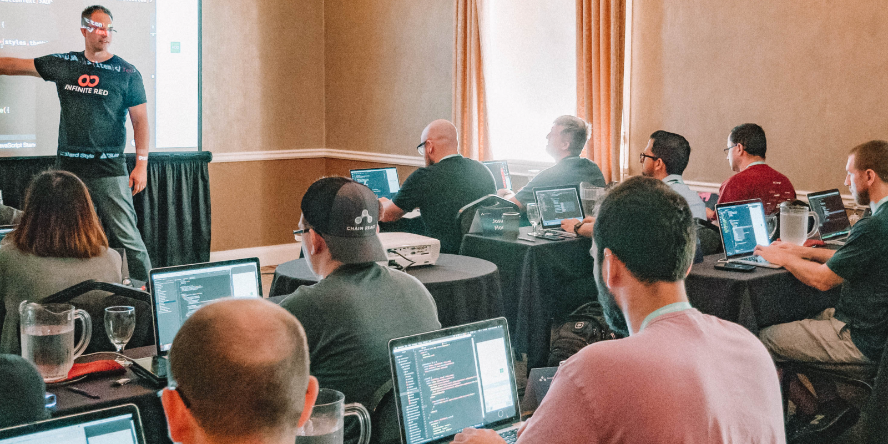
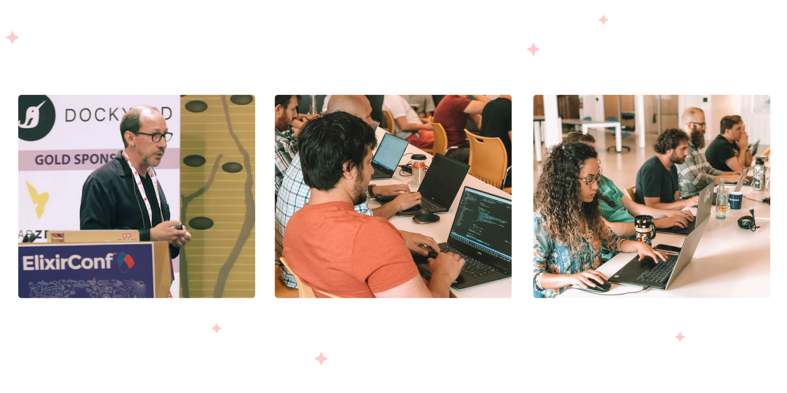

**React Native Training Workshops and Courses, On-Site and Online.**

The Infinite Red team has recently launched the brand new [Infinite Red Academy](https://academy.infinite.red/).

## What is Infinite Red Academy?

Infinite Red Academy is a new division of [Infinite Red, Inc.](https://infinite.red/) that focuses on workshops (both online and on-site), online digital courses, and other educational efforts yet to be announced.

- We conduct an on-site live workshop (like we did for uShip in Austin, Texas just after Chain React!).
- We host a video conference and teach you and others remotely (after all, remote work is our jam).
- We plan to release online digital courses that you can take on your own time from the comfort of your home.

## What is special about Infinite Red Academy?

- The most important aspect of Infinite Red Academy is the our exclusive knowledge gathered through years of consulting work.
- The instructors are Infinite Red software engineers and designers who are coding and designing real-world apps.
- We make the workshops interesting and fun, and we mix it up so the students are always engaged, allowing them to digest and retain the information.
- Our instructors want you to succeed and will be engaging with you after the workshop with our complimentary 30 day chat support.

## What topics do you cover?

- React Native: Our team has extensive React Native experience — we’ve used it since 2015 and known it so well. We also run the US React Native conference, Chain React, and publish the React Native Newsletter with 10,000 subscribers.
- Elixir: We also have a very experienced Elixir team, and recently hosted a workshop at ElixirConf in Bellevue, Washington. We’ve used Elixir for three years now and have built large applications with it.
- Web and App Design: We’re working on design workshops and plan to host one with WebFlow in Portland, Oregon in the coming months.
- Remote Work: We offer company consultations that can help smooth out the rough edges of remote work and help you create a work environment that fosters creativity, collaboration, connection, and communication.

## How much does it cost?

Workshops vary widely. Online workshops are generally less costly than on-site since there is no travel involved. They’re also easier to schedule for the same reason. When you get in touch, we’ll put together a free custom proposal for you.

We are also working on online digital courses that you can take whenever and haven’t determined how much those will cost yet. But stay tuned!

## How can I learn more?

Pretty simple: just head over to [Infinite Red Academy](https://academy.infinite.red/) and submit your info, or email us at academy@infinite.red and let’s chat about your needs. We’ll get in touch and can get you on the schedule if you’re ready to move forward. Our schedule tends to fill up, so reach out so we can start the planning now.

As always, you can hire our amazing team by emailing us at hello@infinite.red. We’d love to work with you!

Check out [Original Source](https://shift.infinite.red/introducing-infinite-red-academy-7d4428f03470) for full story
